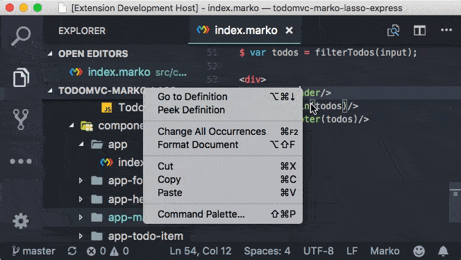

# vscode-marko-peek

Visual Studio Code extension for code navigation of component files in Marko projects

[vscode-marko-peek on the VS Marketplace](https://marketplace.visualstudio.com/items?itemName=martinkchang.vscode-marko-peek)

## Features

Enables `Go To Definition` and `Peek` functionality for [Marko](https://markojs.com/) projects. A VS Code alternative to [atom-hyperclick-marko](https://github.com/marko-js/atom-hyperclick-marko). 

For example if there is an image subfolder under your extension project workspace:



*Demo of `Peek` and `Go to Definition` functionality on [todomvc-marko-lasso-express](https://github.com/marko-js-samples/todomvc-marko-lasso-express)*

The extension supports:

 * Peek: load the .marko file inline and make quick edits right there (`Ctrl+Shift+F12`)
 * Go To: jump directly to the css file or open it in a new editor (`F12` or `Ctrl-click/Cmd+click`)
 * Hover: show the definition in a hover over the symbol (`Ctrl+hover`)

By default searches only for .marko files from other .marko files (e.g. going to a child component from a parent). See [Extension Settings](#extension-settings) for more details on configuring other extensions.

See editor docs for more details

* [Visual Studio Code: Go to Definition/Hover](https://code.visualstudio.com/docs/editor/editingevolved#_go-to-definition)
* [Visual Studio Code: Peek](https://code.visualstudio.com/docs/editor/editingevolved#_peek)

## Extension Settings

There are 2 settings options that allows you to customize targeted files and language in which plugin is activated. By default they look like this:
```
 "vscode-marko-peek.activeLanguages": [
    "marko"
  ],
  "vscode-marko-peek.searchFileExtensions": [
    ".marko"
  ],
```
You can add support for any file extension you like. To allow plugin to search for **.js** files: go to settings, search for _vscode-marko-peek_ and add **.js** extension to _searchFileExtensions_ option.
If you'd like for plugin to be activated in other languages, add that extension (i.e. "js") to _activeLanguages_ array.

## Known Issues

## Release Notes

### 1.0.0

Initial release, built on the shoulders of [vscode-file-peek](https://github.com/abierbaum/vscode-file-peek), [vscode-vue-peek](https://github.com/fuzinato/vscode-vue-peek), and [vscode-css-peek](https://github.com/pranaygp/vscode-css-peek). 
